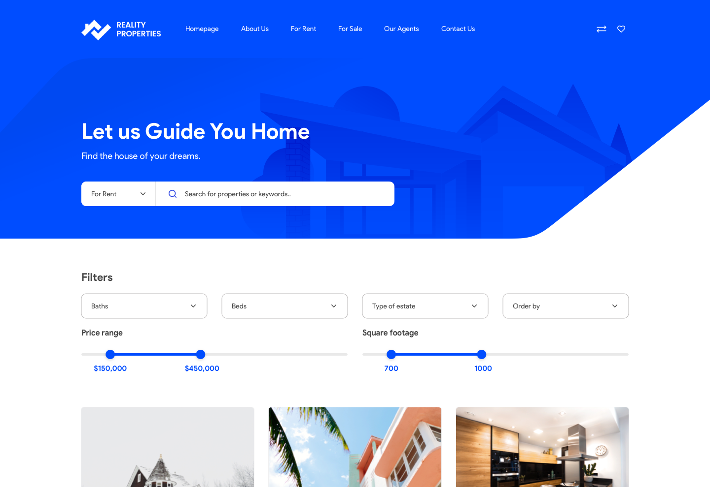

# Frontend Recruitment Task

Hi!

Thank you for joining our recruitment process @ Clean Commit! This task will test how you can work with front end project.

## Task

We have to create a mini app for our clients. Can you ship it?

The design can be found in sources library in .sketch and .fig in sources directory.
Our designers work mostly with Figma, but you can choose whichever you like!

Please use data from this [Google Sheet](https://docs.google.com/spreadsheets/d/e/2PACX-1vRAeVzfe5Xd7y_Ojzl5BxYSTDezszUfCj5PyV_lEYDPsRCX3Ze6F_YTNteG14X_Lf7FqEtHrI7m29nt/pubhtml)

## Requirements

Users should be able to search data by title and location (text-matching), and use filters in the design.

## Rules & Hints

1. You can use Vue or React to complete the task.
2. Use Tailwind as your framework
3. Styles should be written in Sass (SCSS).
4. Pay attention to code quality, formatting, conventions etc. (Your code is your business card)
5. Try to optimize images :)
6. Send us the link to the site and access to your repo to check out your work!
7. You can use Sheetsy for fetching data!
